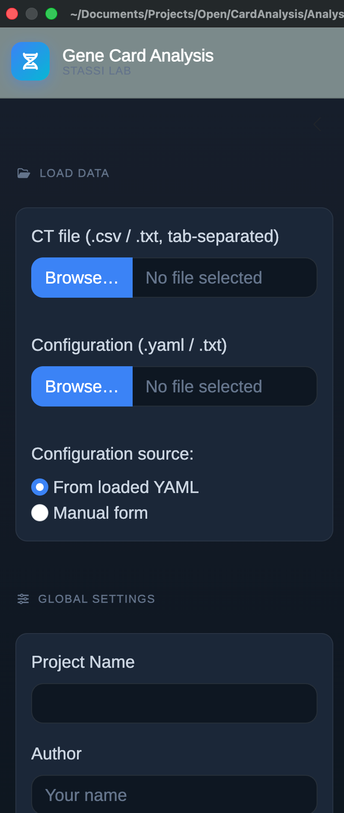
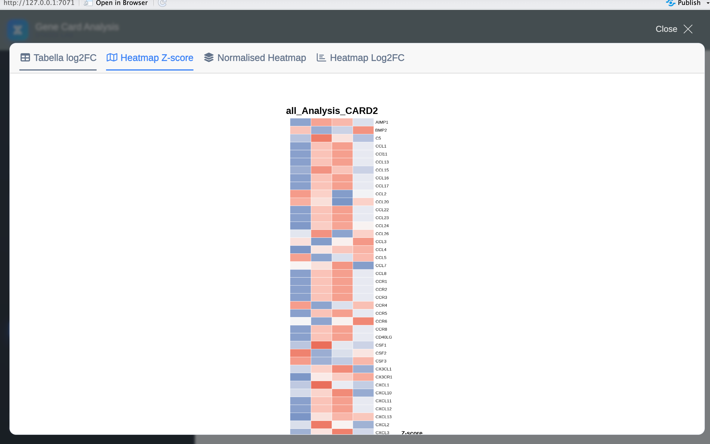
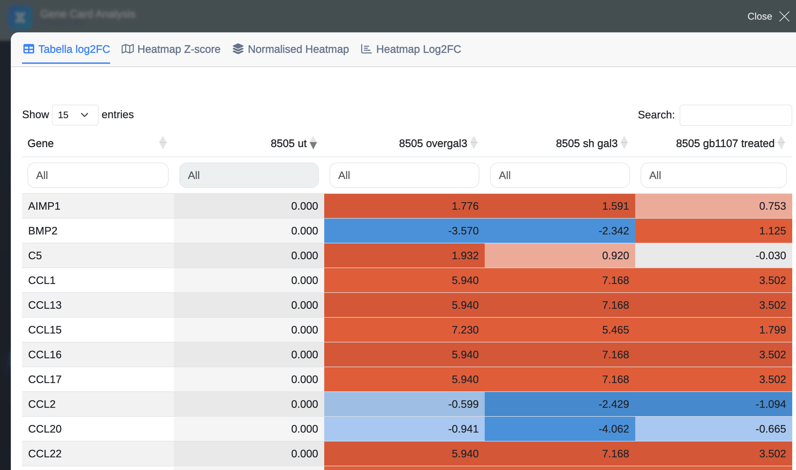
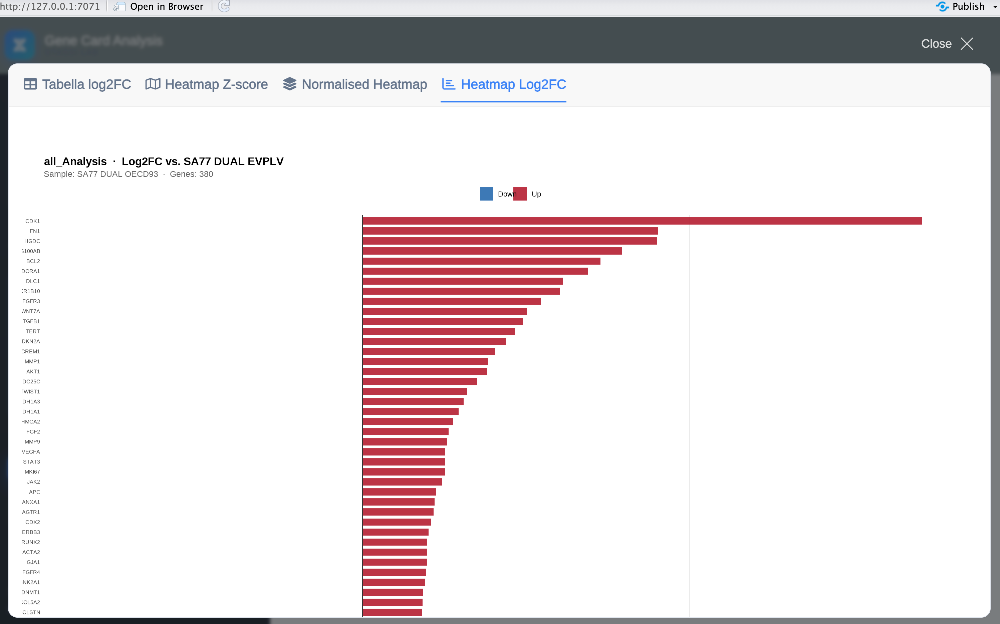

# GeneCardAnalysis 

<!-- badges: start -->
[](https://github.com/BadSeby/GeneCardAnalysis/actions/workflows/R-CMD-check.yml)
[](https://opensource.org/licenses/MIT)
[](https://cran.r-project.org/)
[](https://lifecycle.r-lib.org/articles/stages.html#stable)
[](https://doi.org/PLACEHOLDER)
<!-- badges: end -->

**GeneCardAnalysis** is an R Shiny application for reproducible analysis and
visualisation of RT-qPCR data. It implements the delta-CT normalisation method
([Livak & Schmittgen, 2001](https://doi.org/10.1006/meth.2001.1262)) and produces
publication-ready heatmaps, log2 fold-change tables, and ranked bar charts — all
exportable as PNG, PDF, Excel, and ZIP archives with a single click.

---

## Features

- **Delta-CT normalisation** — automatic or user-specified housekeeping gene(s) (GAPDH / HPRT1)
- **Log2 fold-change** — relative to a user-defined reference condition (e.g. untreated, UT)
- **Z-score heatmaps** — computed on the log2 scale (= −ΔCT), not on raw 2^(−ΔCT) values
- **Normalised heatmaps** — colour scale based on empirical quantiles
- **2-condition bar chart** — ranked horizontal bar chart when only two conditions are present
- **Interactive visualisation controls** — clustering (rows / columns / both), column order, colour palettes
- **YAML-driven reproducibility** — analysis specification lives alongside the data
- **Built-in gene signatures** — EMT, Metastasis, Metabolism; custom panels via YAML
- **One-click exports** — PNG (300 DPI), PDF (vector), Excel (.xlsx), ZIP archive

---

## Screenshots

| Sidebar & Data tab | Z-score Heatmap |
|---|---|
|  |  |

| Log2FC Table | Log2FC Bar chart (2 conditions) |
|---|---|
|  |  |

> **Note:** add screenshots to `www/screenshots/` before publishing.

---

## Installation

### Dependencies

```r
# CRAN
install.packages(c(
  "shiny", "bslib", "circlize", "readxl", "tidyverse",
  "grid", "glue", "writexl", "showtext", "yaml",
  "DT", "colourpicker", "gtools"
))

# Bioconductor
if (!requireNamespace("BiocManager", quietly = TRUE))
  install.packages("BiocManager")
BiocManager::install("ComplexHeatmap")
```

### Install from GitHub

```r
# install.packages("remotes")
remotes::install_github("StassiLab/GeneCardAnalysis")
```

### Run locally without installing

```r
# Clone or download the repository, then from the project root:
shiny::runApp(".")
```

---

## Quick start

### 1. Prepare your data

Export your CT values from QuantStudio or CFX Manager as a CSV with at least
three columns: `Sample.Name`, `Target.Name`, `CT`.

```
Sample.Name,Target.Name,CT
UT,GAPDH,20.1
UT,VIM,25.3
UT,CDH1,29.8
EMT,GAPDH,20.0
EMT,VIM,23.1
EMT,CDH1,31.4
```

### 2. Write a YAML configuration (optional but recommended)

```yaml
project_name: EMT_study
author: SDB
global_settings:
  housekeeping_genes: [GAPDH]
  undetermined_value: 40
  exclude_genes: [RT, gDNA, GDNA, PCR, RQ1, RQ2]
comparisons:
  - name: EMT_vs_UT
    reference: UT
    samples: [UT, EMT]
    signature_type: signature_emt
    cluster_heatmap: true
```

### 3. Launch the app

```r
shiny::runApp(".")
```

Load your CSV and YAML in the sidebar, then press **Run Analysis**.

---

## Using the core functions directly

```r
library(GeneCardAnalysis)  # or: source("card_functions.R")

# Normalise CT values
norm_mat <- extract.normalised.CTs(
  CTs               = your_ct_dataframe,
  housekeeping.gene = "GAPDH",
  undetermined      = 40
)

# Log2 fold-change vs UT
log2fc_mat <- log2(norm_mat / norm_mat[, "UT"])

# Z-score on log2 scale
zmat <- t(scale(t(log2(norm_mat))))
```

See `vignette("GeneCardAnalysis")` for a full walkthrough with verified toy data.

---

## Input format

| Column | Type | Description |
|--------|------|-------------|
| `Sample.Name` | character | Unique sample identifier |
| `Target.Name` | character | Gene symbol |
| `CT` | numeric / `"Undetermined"` | Cycle-threshold value |

Both `,` and `;` separators are auto-detected. CT values using a comma as
decimal separator (European locale) are handled automatically.

---

## YAML configuration reference

```yaml
project_name: string          # project label (appears on heatmap annotations)
author: string or code        # author name or initials code (SDB, FO, RNB)

global_settings:
  housekeeping_genes: [GAPDH] # list; if null, auto-selects by minimum variance
  undetermined_value: 40      # numeric replacement for "Undetermined" calls
  exclude_genes: [RT, gDNA]   # control wells to drop before analysis

custom_signatures:            # optional user-defined gene panels
  MyPanel: [GENE1, GENE2]

comparisons:
  - name: EMT_vs_UT           # unique comparison identifier
    reference: UT             # reference sample (log2FC denominator)
    samples: [UT, EMT_24h]    # subset of samples; omit or use "all" for all
    signature_type: signature_emt   # all | signature_emt | signature_metastasis
                                    # | signature_metabolism | custom_<name>
    cluster_type: both        # none | rows | cols | both  (overrides UI)
```

---

## Built-in gene signatures

| Key | Panel | Genes |
|-----|-------|-------|
| `all` | All detected genes | — |
| `signature_emt` | Epithelial–Mesenchymal Transition | 41 genes |
| `signature_metastasis` | Metastasis | 66 genes |
| `signature_metabolism` | Metabolism | 60 genes |

Custom signatures can be added via the `custom_signatures` YAML key.

---

## Project structure

```
GeneCardAnalysis/
├── app.R                        # Shiny UI + server
├── card_functions.R             # extract.normalised.CTs(), extract.CTs()
├── signatures_genes_card.R      # get_signatures(), build_signature_choices()
├── DESCRIPTION
├── LICENSE
├── paper.md                     # JOSS manuscript
├── paper.bib
├── www/
│   └── custom.css
├── vignettes/
│   └── GeneCardAnalysis.Rmd
└── tests/
    └── testthat/
        ├── helper-setup.R
        ├── test-extract_normalised_CTs.R
        └── test-signatures.R
```

---

## Citation

If you use GeneCardAnalysis in your research, please cite:

> Di Bella S, Orilio F (2026). "GeneCardAnalysis: A Shiny Application for
> Reproducible RT-qPCR Data Analysis and Visualisation."
> *Journal of Open Source Software*. doi: [PLACEHOLDER](https://doi.org/PLACEHOLDER)

BibTeX:
```bibtex
@article{dibella2026genecardanalysis,
  title   = {{GeneCardAnalysis}: A {Shiny} Application for Reproducible
             {RT-qPCR} Data Analysis and Visualisation},
  author  = {Di Bella, Sebastiano and Orilio, Francesco},
  journal = {Journal of Open Source Software},
  year    = {2026},
  doi     = {PLACEHOLDER}
}
```

---

## Contributing

Bug reports and feature requests are welcome via
[GitHub Issues](https://github.com/BadSeby/GeneCardAnalysis/issues).
Pull requests should include tests (`testthat`) and updated documentation.

---

## License

MIT © 2026 Sebastiano Di Bella, Francesco Orilio, Rosario Nicola Brancaccio
